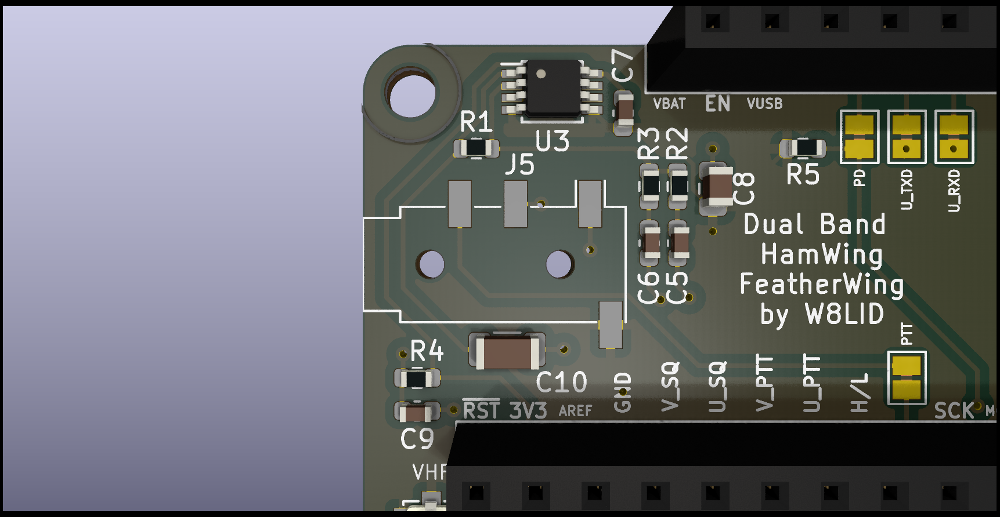

# HamWing
A FeatherWing for Dorji DRA818V/U modules that is compatible with Adafruit Feather system.

## HamWing Board Images

Front board render:

Back board render:

Full board view:

Additional board views:

The HamWing FeatherWing allows you to create a fully functional VHF/UHF transceiver using the Adafruit Feather platform. It has the same physical dimensions as the Feather Tripler making it easy to add a microcontroller as well as other FeatherWings like an OLED for a display. The modules are powered via the BAT pin to allow use with a LiPo pack connected to the Feather used for control. The HamWing was designed around the use of an Adafruit Feather M0 but should be compatible with other Feathers as well. We will list other compatible boards as they are verified to work.

The HamWIng can be built as a single band transceiver by populating only one RF module, low pass filter components and u.FL connector.

A 4 pin TRRS jack is used for a speaker mic with PTT button. A LM4810 amplifier is used for audio out. Mic input is shared with both modules. The PTT line is connected to a GPIO pin for use in keying the DRA818 module(s). Configuration of the modules is accomplished using AT commands via serial UART connected to each. The VHF module uses the default serail UART. The UHF module uses a second serial UART created using a SERCOM. This should also work on other Feathers using Software Serial.

Ouput of the modules is connected to a low pass filter to supress harmonics before being routed to a u.FL connector for each.

This project uses the following license for hardware, software and documentation.

## DRA818 Pin And Signal Assignments (From KiCad Project)

The tables below are derived from `KiCad/FeatherWing_KC5.kicad_pcb` and cross-checked with `KiCad/FeatherWing_KC5.sch`.

### DRA818 Pins Quick Reference

U1 is the VHF module position (DRA818V) and U2 is the UHF module position (DRA818U).

| DRA818 Pad | Board-Level Function |
|---|---|
| 8 | VBAT supply input |
| 9, 10 | Ground |
| 12 | RF output into LPF and then u.FL connector |
| 16, 17 | UART/control serial path (direct on U1, jumper-routed on U2) |
| 6, 7 | Shared control lines (JP4-selectable + common A4 line) |
| 18 | Shared audio/control node tied to C9 network |

For full per-pad net assignments for both modules, use the complete table below.

### DRA818 Module Pad Mapping

| DRA818 Pad | U1 (DRA818V) Assignment | U2 (DRA818U) Assignment | Notes |
|---|---|---|---|
| 1 | A0 | A1 | Feather GPIO/analog control lines |
| 2 | Net-(U1-Pad2) | Net-(U2-Pad2) | Internal module signal (not named in schematic) |
| 3 | Net-(C5-Pad1) | Net-(C6-Pad1) | Coupled through C5/C6 into audio chain |
| 4 | Net-(U1-Pad4) | Net-(U2-Pad4) | Internal module signal (not named in schematic) |
| 5 | A2 | A3 | Feather GPIO/analog control lines |
| 6 | Net-(JP4-Pad1) | Net-(JP4-Pad1) | Shared control line, jumper-selectable to F5 |
| 7 | A4 | A4 | Shared control line to both modules |
| 8 | VBAT | VBAT | Module supply from Feather battery rail |
| 9 | GND | GND | Ground |
| 10 | GND | GND | Ground |
| 11 | Net-(U1-Pad11) | Net-(U2-Pad11) | Internal module signal (not named in schematic) |
| 12 | Net-(L3-Pad2) | Net-(L6-Pad2) | RF output path into LPF network and u.FL |
| 13 | Net-(U1-Pad13) | Net-(U2-Pad13) | Internal module signal (not named in schematic) |
| 14 | Net-(U1-Pad14) | Net-(U2-Pad14) | Internal module signal (not named in schematic) |
| 15 | Net-(U1-Pad15) | Net-(U2-Pad15) | Internal module signal (not named in schematic) |
| 16 | TX | Net-(JP2-Pad2) | U1 on Feather UART TX; U2 via JP2 to F3 |
| 17 | RX | Net-(JP1-Pad2) | U1 on Feather UART RX; U2 via JP1 to F4 |
| 18 | Net-(C9-Pad2) | Net-(C9-Pad2) | Shared AC-coupled/bias audio/control input node |

### Feather Header And Jumper Routing

| Board Signal | Source | Destination |
|---|---|---|
| TX | Feather J1 pin 2 | U1 pad 16 |
| RX | Feather J1 pin 3 | U1 pad 17 |
| F3 | Feather J2 pin 6 | JP2 pad 1 (bridge to U2 pad 16 when closed) |
| F4 | Feather J2 pin 7 | JP1 pad 1 (bridge to U2 pad 17 when closed) |
| F5 | Feather J2 pin 8 | JP4 pad 2 (bridge to shared U1/U2 pad 6 node when closed) |
| A5 | Feather J1 pin 7 | JP3 pad 2 (speaker-mic PTT route when closed) |

### Other Functional Connections

| Function | Connection Summary |
|---|---|
| VHF RF output | U1 pad 12 -> L3/L2/L1 LPF network -> J3 (u.FL) |
| UHF RF output | U2 pad 12 -> L6/L5/L4 LPF network -> J4 (u.FL) |
| Speaker-mic jack | J5 includes ground, PTT path, and shared mic/input path |
| Audio amp | U3 (LM4810) provides amplified audio output to the speaker-mic path |
| Shared mic/control bias | R4/C9 network ties J5 input path to shared U1/U2 pad 18 node |

### Notes

- Some DRA818 nets are unnamed in this project (`Net-(Ux-PadY)`). The board files identify routing, but not all module function names.
- To map every unnamed pad to official DRA818 pin function names, cross-reference these pad numbers with the DRA818 datasheet pinout.

